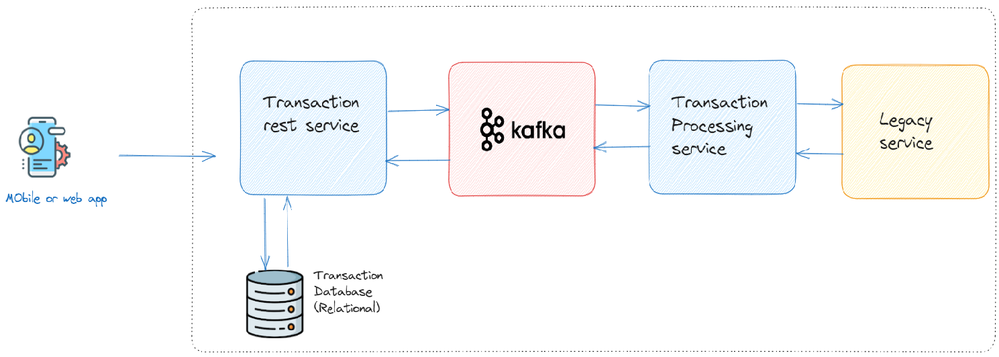
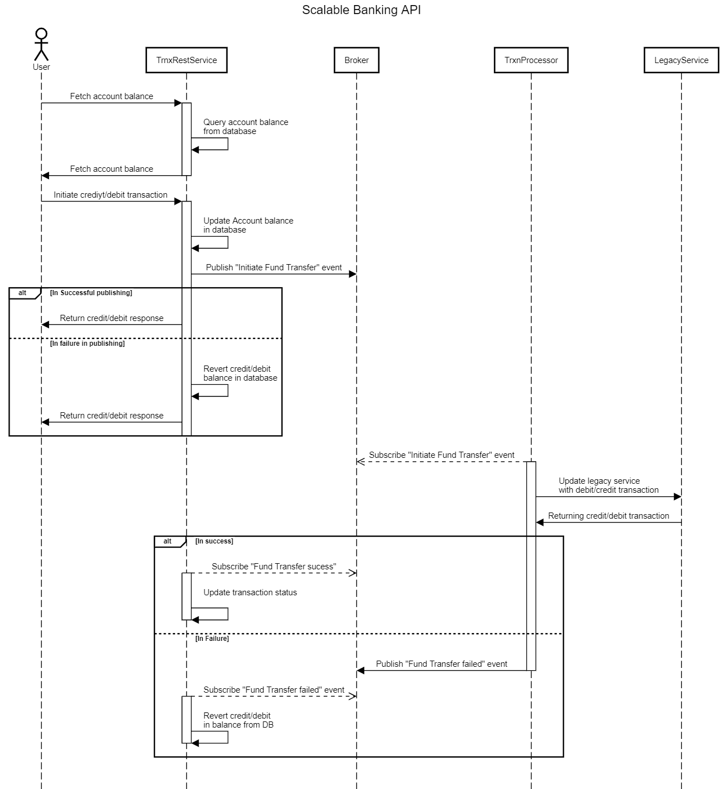

# Zand system

### Table of Contents
- [Introduction](#introduction)
- [Block-diagram](#block-diagram)
- [Sequence Diagram](#sequence-diagram)
- [Pre-requisite](#pre-requisite)  
- [Module anatomy](#module-anatomy)
- [Local Run](#local-run)
- [Steps to verify the flow](#steps-to-verify-the-flow)
- [Design Decisions](#design-decisions)
- [Assumptions](#assumptions)
- [In-progress items](#in-progress-items)

## Introduction

Microservices Architecture approach of a scalable REST API for a banking
system that handles debit and credit transactions for individual accounts. The goal is to
create a system that efficiently manages a large volume of requests in parallel without
overwhelming an existing legacy system with limited throughput capabilities. Key concepts
employed in this solution include:
- Microservices: Breaking down the system into smaller, independent services.
- CQRS (Command Query Responsibility Segregation): Separation of write
(transaction) and read (balance) operations.
- Kafka: Facilitating communication between microservices.
- Event-Driven Architecture: Microservices communicate via events for scalability
and maintainability.

## Block-diagram

## Sequence Diagram

## Components
### Transaction-Rest-Service
- Functionality
  - This service handles debit and credit transactions by exposing the
    REST API for transactions and balance API.
  - It saves the balance information in the relational database to provide
    more real time balance.
  - Also publishes an “Initiate Fund Transfer” event to kafka which will
    eventually update the legacy system asynchronously
- Technology
  - Java, Spring boot, Webflux, Postgresql, kafka

### Transaction-Processor-Service
- Functionality
  - It subscribed to the “Initiate Fund Transfer” event with kafka.
  - Once this event is received, It will update the legacy system through
  rest api.
  - If the Call to the legacy system is done it will publish "success" or "failure" events to broker
  - It uses bucket4j with redis cache as rate limiter, while communicating with the Legacy-Service to
  ensure transaction processing without overwhelming it
- Technology
  - Java, Spring boot, Redis, kafka

### Legacy-Service
- Functionality
  - The Legacy-Service serves as a mock legacy system simulator, emulating the
  behaviour and limitations of the actual legacy system.
  - It exposes an API with certain TPS for handling transaction requests.
- Technology
  - Java, Spring boot

### Kafka-Server
- Functionality
  - Kafka serves as a message broker for facilitating communication
    between microservices through an event-driven architecture.
- Technology
  - Java, Spring boot Kafka

## Pre-requisite

Please make sure your machine has the following things installed,
- IDE: IntelliJ IDEA (preferred)
  - `Java 17` (can be installed easily using IDE if you have one)
  - `Maven 3.8.*` (again comes bundled with most of the IDE)
  - Checkout this project as whole
    - It is a multi-module mono-repo consists of all the required modules together.
  - Select maven's `clean install` goals from maven section of the IDE
  
  (or)

- If you prefer terminal, you can use `mvnw` (maven wrapper) comes with this repository itself
  - `./mvnw clean install` from the root of the directory to build all the modules.

## Module anatomy
  - All the services have a `common` maven module dependency.
  - Service modules are suffixed with `**-service` & `**-server`
    - can be run individually
  - `kafka-server` module is a `Embedded Kafka` setup using spring-boot. And it is good enough for this demo app.
    - All the required kafka `topics` are created automatically when it is up.
    - It is visible only on `localhost` and not configured for remote execution.
    - Message serialization: `Json` serializer is used for messages. Due to demo app, we haven't gone with `Avro` format
    & `schema-registry`.
 
## Local Run 
Steps to locally run the required applications,
  - Please run the below services,
    - Using maven
      - Step 1: Open `terminal` and move to the `zand-fund-transfer` directory
        - `cd {your-location}/zand-fund-transfer` 
      - Step 2: Move to the `common-messaging` directory and build the
        - `./mvn clean install --file ./common-mesaging/pom.xml`
      - Step 3: Run each of the below commands on a separate terminal,
        - Move to the `kafka-server` and run `./mvn clean spring-boot:run`  - recommended to start this first. [refer](./kafka-stream/README.md)
        - Move to the `transaction-rest-service` and run `./mvn clean spring-boot:run`. [refer](./transaction-rest-service/README.md)
        - Move to the `transaction-proceessor` and run `./mvn clean spring-boot:run`. [refer](./transaction-proceessor/README.md)
        - Move to the `legacy-service` and run `./mvn clean spring-boot:run`. [refer](./legacy-service/README.md)

       **(or)**

    - Using IDE as spring boot application,
      - `common-messaging` - Build this repo first
      - `kafka-server` - recommended to start this first.
      - `transaction-rest-service`
      - `transaction-processor`
      - `legacy-service`

  - Once all the services are up & running, then go to service specific Swagger UI to execute the flows as 
described below.

## Steps to verify the flow

## Design Decisions

## Assumptions

## In-progress items
- Unit test
- Retry the on the kafka publisher calls and rest calls
- Reverse sync on the balance, if any update occurred core banking (by some other means)

