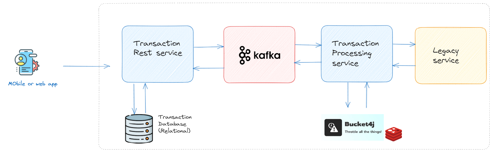
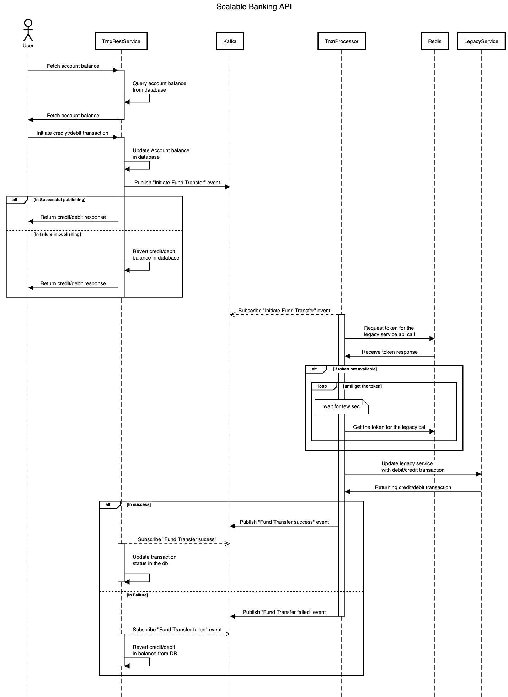

# API-modernisation

### Table of Contents

- [Introduction](#introduction)
- [Architecture Overview](#architecture-overview)
- [Approach & Design Considerations](#approach--design-considerations)
- [Sequence Diagram](#sequence-diagram)
- [Real-Time Balance Calculation](#real-time-balance-calculation)
- [Installation Steps](#installation-steps)
- [Steps to Verify the Flow](#steps-to-verify-the-flow)
- [Unit Test](#unit-test)
- [Future Enhancements](#future-enhancements)

## Introduction

### Purpose of the Document
This architecture document aims to provide a detailed overview of the banking transaction processing solution, highlighting its design, components, and functionality. It serves as a comprehensive reference for developers, architects.

### Problem Statement Recap
The project's goal is to build a scalable REST API for banking transactions, managing debit and credit operations while preventing the legacy system's overload. Key challenges include handling large volumes of requests and maintaining real-time balance accuracy.

### Objectives and Goals
The architecture's objectives include achieving scalability, ensuring accurate real-time balances, demonstrating legacy system slowness, and providing a robust API for banking transactions.

## Architecture Overview

The architecture consists of four main components: Transaction-Rest-Service, Transaction-Processor-Service, Legacy-Service, and Kafka-Server. These components work together to enable seamless transaction processing.

### Transaction-Rest-Service
The Transaction REST Service acts as the central gateway for debit and credit transactions in the banking system. It enables clients to initiate transactions, updates account balances in real time, and communicates asynchronously with the legacy system through event publication to Kafka. Furthermore, it subscribes to "Fund Transfer Success" and "Fund Transfer Failure" events, ensuring that balance and transaction details are consistently updated based on transaction outcomes.
- Technologies : Java, Spring boot, Kafka, Postgresql

### Transaction-Processor-Service
The Transaction-Processor-Service is at the core of our banking architecture, diligently subscribing to the "Fund Transfer" event via Kafka. Once this event is received, it swiftly updates the legacy system through a REST API, ensuring seamless transaction processing. Additionally, it actively monitors the interaction, promptly publishing either "success" or "failure" events to the broker to communicate transaction outcomes transparently. To prevent overwhelming the legacy system, the service employs advanced rate-limiting mechanisms using Bucket4j with Redis cache, ensuring that transaction processing remains within the constraints of the legacy infrastructure.
- Technology : Java, Spring boot, Redis, kafka

### Legacy-Service
The Legacy-Service stands as a critical component within our banking architecture, serving as the bedrock for core banking REST APIs. Operating within specified transactions per second (TPS) constraints, this service shoulders the essential responsibility of processing fund transfer requests and effecting updates in the core database. While its primary function is to facilitate seamless transaction processing, it also serves as a testament to legacy API behavior by adhering to the predefined TPS limits.
- Technology
  - Java, Spring boot

### Kafka-Server
Kafka-Server, our chosen message broker, serves as the central hub for enabling efficient communication among microservices within our architecture, following an event-driven paradigm. It acts as the key conduit, orchestrating the seamless flow of events and messages, ensuring timely and effective data exchange between the various components. This service is purpose-built to demonstrate the capabilities of Kafka in a development environment, specifically utilizing Java Spring Boot. It exemplifies the foundational role of Kafka in our banking system's event-driven architecture
- Technology
  - Java, Spring boot Kafka

## Approach & Design Considerations

- **Rest API with Non-Blocking Design**: Opting for REST APIs with a non-blocking design ensures high responsiveness and efficient resource utilization across instances. This approach allows the system to seamlessly handle concurrent transactions while making optimal use of available resources. The benefit is twofold: a responsive and uninterrupted banking experience for users, coupled with cost-effective resource utilization that maximizes the system's efficiency and scalability.

- **Event-Driven Architecture and Messaging**: Embracing an event-driven architecture and leveraging Kafka messaging facilitates asynchronous communication between microservices. This design enhances system scalability and responsiveness while ensuring data consistency. The benefit lies in the ability to handle a large volume of transactions without overwhelming the infrastructure, thus improving system reliability.

- **Throttling Using Bucket4j and Redis Cache**: Implementing rate limiting mechanisms with Bucket4j and Redis Cache prevents the overloading of the Legacy-Service. This responsible usage of limited resources ensures system stability, guards against performance degradation, and maintains a consistent quality of service. The benefit is a reliable and efficient transaction processing system that respects the limitations of the legacy infrastructure.

- **Efficient Microservice Resource Utilization**: The architecture optimizes resource utilization across microservices, ensuring that they efficiently handle tasks and scale as needed. This efficiency results in cost-effective operations, minimized resource wastage, and improved overall system performance, enabling a streamlined and economical deployment of microservices within the banking ecosystem.

## Sequence Diagram

In this diagram, the primary components and their interactions are depicted, highlighting the movement of data and events through the system.

### Real-Time Balance Calculation

#### Calculation Logic
The Real-Time Balance Calculation component within the Transaction-Rest-Service is responsible for maintaining accurate and up-to-date balance information for user accounts. The logic involved in real-time balance calculation includes:

**Initialization:** Upon system startup, the initial balance for each account is retrieved from a data store, typically a relational database. This initial balance serves as the starting point.

**Transaction Processing:** When a debit or credit transaction is initiated through the REST API, the Transaction-Rest-Service processes the transaction by updating the account's balance in real time. The calculation is straightforward:

- For debit transactions, the transaction amount is subtracted from the current balance.
- For credit transactions, the transaction amount is added to the current balance.

**Asynchronous Updates:** It's important to note that these balance updates occur asynchronously to ensure that the legacy system is not overwhelmed. The Transaction-Rest-Service publishes "Initiate Fund Transfer" events to Kafka for processing by the Transaction-Processor-Service, which updates the Legacy-Service and ensures eventual consistency.

#### Relational Database Usage

To store and manage account balances and transaction history, a relational database, such as PostgreSQL, is used. The database schema includes tables for account details, transactions, and balances. Real-time balance updates are reflected in the database, enabling accurate reporting and querying of account balances.

#### Handling Inflight Transactions

One of the critical challenges addressed by the architecture is handling inflight transactions—those that are initiated but not yet processed by the legacy system due to its throughput limitations. The architecture takes into account such transactions when calculating real-time balances.

For example, if a debit transaction reduces the account balance and a credit transaction increases it, the balance calculation includes both transactions, even if one or both are still in the process of being sent to the legacy system. This ensures that the end-users see an accurate reflection of their balance, considering all pending transactions.

## Installation Steps

Please make sure your machine has the following things installed,
  - `Java 17` (can be installed easily using IDE if you have one)
  - `Maven 3.8.*` (again comes bundled with most of the IDE)

Steps to locally run the required applications,
  - Please run the below services,
    - Using maven
      - Step 1: Open `terminal` and move to the `zand-fund-transfer` directory
        - `cd {your-location}/zand-fund-transfer` 
      - Step 2: Move to the `common-messaging` directory and build the
        - `./mvn clean install --file ./common-mesaging/pom.xml`
      - Step 3: Run each of the below commands on a separate terminal,
        - Move to the `kafka-server` and run `./mvn clean spring-boot:run`  - recommended to start this first. [refer](./kafka-stream/README.md)
        - Move to the `transaction-rest-service` and run `./mvn clean spring-boot:run`. [refer](./transaction-rest-service/README.md)
        - Move to the `transaction-proceessor` and run `./mvn clean spring-boot:run`. [refer](./transaction-proceessor/README.md)
        - Move to the `legacy-service` and run `./mvn clean spring-boot:run`. [refer](./legacy-service/README.md)

  - Once all the services are up & running, then go to service specific Swagger UI to execute the flows as 
described below.

## End to end simulation

PLease find the postman collection in given [link](./postman/API-modernisation.postman_collection.json)

- [Legacy-service Postman screenshot](./doc/Legacy-postman-screenshot.pdf)
- [Transaction-REST-Service Postman screenshot](./doc/Transaction-REST-Service-postman-screenshot.pdf)

## Unit Test

- **Transaction-REST-Service**:
  
- **Transaction-Processor**:
  

## Future Enhancements
As the system evolves, consider potential future enhancements and optimizations, such as:

- **Advanced Rate Limiting**: Implement dynamic rate limiting strategies based on the legacy system's real-time load.
This ensures optimal resource allocation, preventing system overload during high-demand periods.
- **Retry Handling**: Enhance fault tolerance with robust retry mechanisms and circuit breakers for REST API and Kafka calls.
This improves reliability by intelligently managing transient errors and service failures.
- **Reverse Synchronization on Balance Updates**: Develop a mechanism to detect and reconcile external balance updates with internal records.
This maintains data consistency, regardless of the source of balance modifications.

